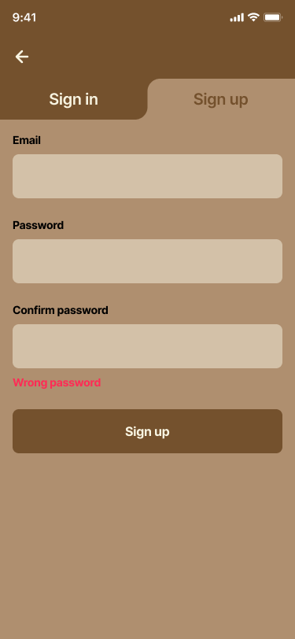

# 📓 Expense Note

Expense Note is a simple money tracking app that lets you record your spending over a specific period and provides statistics to give you insights into your spending habits.

## 🌟 Features

- Layer-first structure
- State management with **Bloc/Cubit**
- Firebase **Authentication**, **Crashlytics**, **Cloud Firestore**

## 📸 Screenshots

|  |  |  | 
|---|---|---|
|  |  |  |